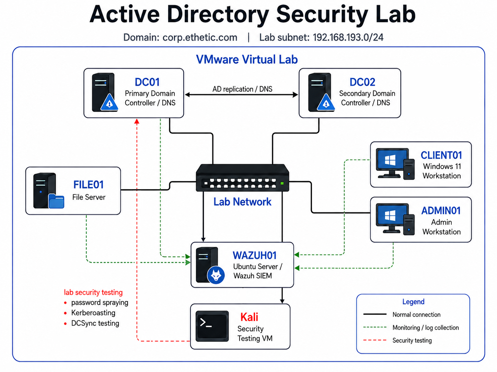
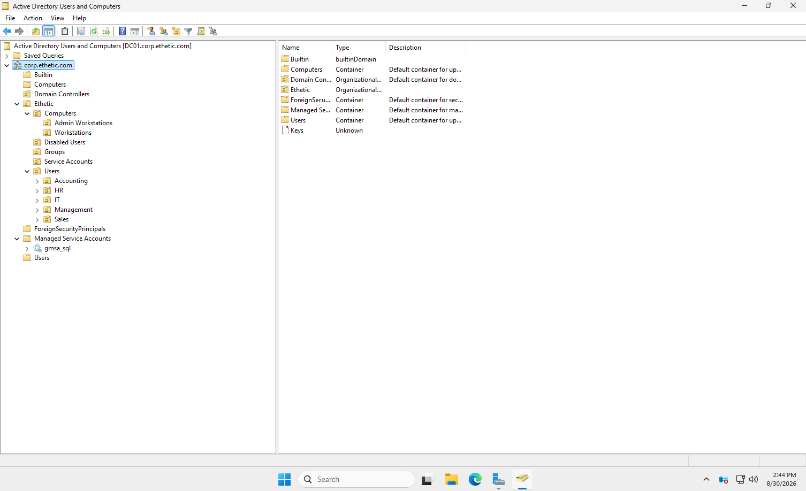
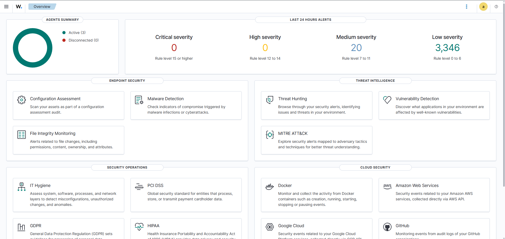
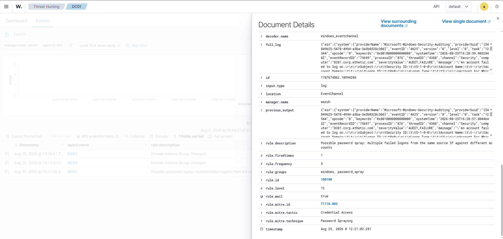

# Active Directory Security Lab

A hands-on Windows enterprise homelab built to develop practical experience with Active Directory administration, security hardening, attack simulation, detection engineering, and PowerShell automation.

The environment simulates a small corporate Windows domain with multiple domain controllers, Windows endpoints, a file server, centralized logging, and an attacker system.



## Lab Environment

- Windows Server 2025
- Active Directory Domain Services
- DNS
- Group Policy
- Windows 11 endpoints
- Windows file server
- Windows LAPS
- Group Managed Service Accounts (gMSA)
- Wazuh SIEM
- Ubuntu Server
- Kali Linux
- VMware

### Domain

`corp.ethetic.com`

### Systems

| System | Role |
|---|---|
| DC01 | Primary Domain Controller / DNS |
| DC02 | Secondary Domain Controller / DNS |
| FILE01 | Windows File Server |
| CLIENT01 | Domain-joined Windows 11 workstation |
| ADMIN01 | Administrative workstation |
| WAZUH01 | Wazuh SIEM server |
| Kali | Security testing system |

---

## Active Directory Administration



Built and administered a structured Active Directory environment including:

- Organizational Units for users, computers, service accounts, and groups
- Department-based user organization
- Security groups and role-based access
- Domain-joined Windows endpoints
- Multiple domain controllers
- DNS configuration and troubleshooting
- File shares with NTFS and share permissions
- Group Policy configuration
- Account lockout and password policies
- Administrative delegation

---

## Group Policy & Endpoint Management

Configured Group Policy for:

- Password and account lockout policies
- Workstation screen locking
- Network drive mappings
- Advanced Windows auditing
- Process creation auditing
- Windows LAPS
- Security policy enforcement

---

## Identity & Credential Security

### Windows LAPS

Deployed Windows LAPS to manage unique local administrator passwords across workstations.

Configured:

- Active Directory password backup
- Authorized password retrieval
- Password rotation
- Dedicated managed local administrator account

Verified unique passwords across endpoints and tested password expiration/rotation.

### Group Managed Service Accounts

Created and deployed a gMSA for a simulated SQL service.

Used the gMSA to replace a traditional user-based service account with a managed, automatically rotated credential.

---

## Attack Simulation

Security testing was performed only inside the isolated lab environment.

### Password Spraying

Simulated a low-volume SMB password spray from Kali Linux.

Validated Windows authentication failures including:

- Event ID 4625
- Source IP
- Target account
- Logon type
- NTLM authentication
- Failure status codes

### Kerberoasting

Created a deliberately vulnerable service account with an MSSQL SPN and requested a Kerberos service ticket from Kali using Impacket.

The exercise demonstrated:

- Service Principal Names
- TGT and TGS behavior
- Kerberos service-ticket encryption
- Offline password-guessing risk
- AES Kerberos ticket types
- gMSA-based remediation

### DCSync Misconfiguration

Deliberately granted replication permissions to a non-administrative account.

Used Impacket to demonstrate how excessive directory replication permissions could expose Active Directory credential material.

Removed the permissions after testing.

### Privileged Group Modification

Simulated unauthorized Domain Admin membership changes and monitored the corresponding Active Directory security events.

---

## Security Monitoring / Wazuh



Deployed a Wazuh SIEM server and enrolled Windows systems as agents.

Centralized Windows Security logs including:

- 4624 — Successful logon
- 4625 — Failed logon
- 4672 — Privileged logon
- 4688 — Process creation
- 4720 — User account creation
- 4726 — User account deletion
- 4728 / 4729 — Security group membership changes
- 4740 — Account lockout
- 4768 — Kerberos TGT request
- 4769 — Kerberos service ticket request

Built custom Wazuh detections for:

- Password spraying
- Domain Admin membership changes
- Suspicious Kerberos service-ticket activity

Attack simulations were then repeated to verify telemetry and detection behavior.

---



## PowerShell Automation

Created PowerShell scripts for common Active Directory administration tasks.

Examples include:

- Bulk creation of 30 AD users from CSV
- Disabling terminated users
- Moving terminated users into a dedicated OU
- Finding locked accounts
- Finding disabled accounts
- Identifying inactive users
- Reporting group memberships
- Creating security groups
- Moving users between OUs
- Querying Windows Security logs
- Exporting administrative/security reports to CSV

Scripts include basic validation, error handling, duplicate detection, and readable status output.

---

## Repository Structure

```text
active-directory-security-lab/
│
├── README.md
│
├── diagrams/
│   └── network-diagram.png
│
├── docs/
│   ├── architecture/
│   │   ├── domain-design.md
│   │   ├── gpo-design.md
│   │   └── permissions-model.md
│   │
│   ├── case-studies/
│   │   ├── account-lockout.md
│   │   ├── broken-gpo.md
│   │   ├── dns-failure.md
│   │   ├── replication-failure.md
│   │   └── broken-trust.md
│   │
│   └── security/
│       ├── password-spray-investigation.md
│       ├── kerberoasting-remediation.md
│       ├── laps-deployment.md
│       └── privileged-group-monitoring.md
│
├── powershell/
│   ├── Create-ADUsers.ps1
│   ├── Disable-TerminatedUsers.ps1
│   ├── List-LockedAccounts.ps1
│   ├── List-DisabledAccounts.ps1
│   ├── Find-InactiveUsers.ps1
│   ├── Report-GroupMemberships.ps1
│   ├── Create-SecurityGroups.ps1
│   ├── Query-SecurityLogs.ps1
│   └── Export-SecurityLogReport.ps1
│
├── sample-data/
│   ├── ad_users_sample.csv
│   └── terminated_users_sample.csv
│
└── screenshots/
    ├── active-directory/
    ├── group-policy/
    ├── permissions/
    ├── laps/
    ├── wazuh/
    ├── powershell/
    ├── troubleshooting/
    └── security-testing/
